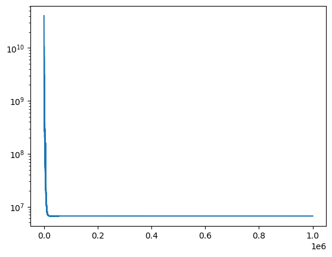
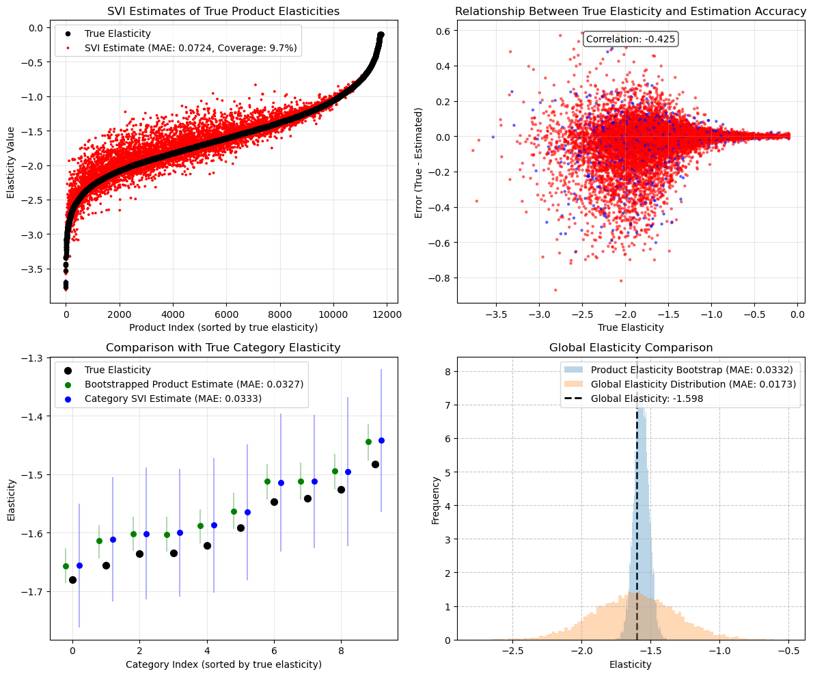

# Estimating product-level price elasticities using Hierarchical Bayesian

In this article, I will introduce you to hierarchical Bayesian modelling, a flexible modeling approach to automatically combine the results of multiple sub-models. This method enables estimation of individual-level effects by optimally combining information across different data groupings through Bayesian updating. This approach is particularly valuable when individual units have limited observations but share characteristics with similar units.

The following sections will introduce the concept, implementation, and alternative use cases for this method. 

### The Problem with Traditional Approaches
As an application, imagine that we’re a large grocery store trying to maximize product-level revenue by setting prices. We would need to estimate the demand curve (elasticity) for each product, then optimize some profit maximization function. As a part of this workstream, we would first need to estimate the price elasticity of demand (how responsive demand is to a 1% change in price) using longitudinal data with $i \in N$ products over $t \in T$ periods. Remember that elasticity so defined as:
```math
\beta=\frac{\partial \log{\textrm{Units}}_{it}}{\partial \log \textrm{Price}_{it}}
```
Assuming no confounders, using a standard [fixed-effect regression model](https://theeffectbook.net/ch-FixedEffects.html) of log units sold on log price:

```math
\log(\textrm{Units}_{it})= \beta  \log(\textrm{Price})_{it} +\gamma_t+ \delta_i+ \epsilon_{it}
```

Where $\gamma_{c(i),t}$ is a set of category-by-time dummy variables to capture the average demand of each unique category in each time period. $\delta_i$ are product dummies to capture the time-invariant heterogenous preferences of consumers for each product. This “fixed-effect” formulation is standard and common in many regression-based models to control for unobserved confounders.

This estimation would allow us to recover the average elasticity $\beta$ across all $N$ units. This would mean that the store could target an average price level across all products in their store to maximize revenue. If these units have a natural grouping (product categories), we might be able to identify the average elasticity of each category by running separate regressions (or interacting the price elasticity with the product category) for each category using only units from that category. This would mean that the store could target average prices in each category to maximize category-specific revenue. With sufficient data, we could even run separate regressions for each individual product to obtain more granular elasticities. 

However, real-world data often presents challenges: some products have minimal price variation, short sales histories, or uneven representation across categories. Under these real-world restrictions, running separate regressions to identify product elasticity would likely lead to large standard errors or no significant results for many products/categories. Hierarchical Bayesian modeling addresses these issues by sharing statistical strength both across and within while preserving heterogeneity across groups. With hierarchical Bayesian, it is possible to run one single regression (like the pooled case) while still recovering elasticities at the product level.  


### Understanding Hierarchical Bayesian Models
At its core, hierarchical Bayesian modeling is about recognizing the natural structure in our data. Rather than treating all observations as completely independent (separate regreeions) or forcing them to follow identical patterns (pooled regression), we acknowledge that observations often cluster into groups, with similarities within groups and differences between them. The "hierarchical" aspect refers to how we organize our parameters in different levels. In its most basic format, we might have:
 - A global parameter that applies to all data.
 - Group-level parameters that apply to observations within that group.
 - Individual-level parameters that apply to each specific individual.

This methodology is flexible enough to add or remove hierarchies as needed, depending on the desired level of pooling. For example, if we think there are no similarities across categories, we could remove the global parameter. If we think that these products have no natural groupings, we could remove the group-level parameters. If we only care about the group-level effect, we can remove the individual-level parameter and have the group-level as our lowest level of observation. If there exists the presence of subgroups, we can add another hierarchical layer. The possibilites are endless!

The "Bayesian" aspect refers to how we update our beliefs about these parameters based on observed data. We first start with a proposed prior distribution that represent our initial belief of these parameters, then update them iteratively to recover a posterior distributions that incorporates the information from the data. In practice, this means that we use the global-level estimate to inform our group-level estimates, and the group-level parameters to inform the unit-level parameters. Units with a larger number of observations are allowed to deviate more from the mean, while units with a limited number of observations are pulled closer to the group level means. Let's formalize this with our price elasticity example, where we (ideally) want to recover the unit-level price elasticity. We estimate:

```math
\log(\textrm{Units}_{it})= \beta  \log(\textrm{Price})_{it} +\gamma_{c(i),t}+ \delta_i+ \epsilon_{it}
```

Where:
 - $\beta_i \sim \textrm{Normal}(\beta_{c\left(i\right)},\sigma_i)$
 - $\beta_{c(i)}\sim \textrm{Normal}(\beta_g,\sigma_{c(i)})$
 - $\beta_g\sim \textrm{Normal}(\mu,\sigma)$

The only difference from the first equation is that we replace the global $\beta$ term with product-level betas $\beta_i$. We specify that the unit level elasticity $\beta_i$ is drawn from a normal distribution centered around the category-level elasticity average $\beta_{c(i)}$, which is drawn from a shared global elasticity $\beta_g$. For the spread of the distribution $\sigma$, we can assume a hierarchical structure for that too, but in this example, we just set basic priors for them to maintain simplicity. One example of our prior beliefs can be: $\{ \mu= -2, \sigma= 1, \sigma_{c(i)}=1, \sigma_i=1\}$. This formulation of the prior assumes that the global elasticity is elastic, 95% of the elasticities fall between -4 and 0, with a standard deviation of 1 at each hierarchical level. To test whether these priors are correctly specified, we would do a [prior predictive checks](https://www.pymc.io/projects/docs/en/stable/learn/core_notebooks/posterior_predictive.html) (not covered in this article) to see whether our prior beliefs can recover the data that we observe. 

This hierarchical structure allows information to flow between products in the same category and across categories. If a particular product has limited price variation data, its elasticity will be pulled toward the category elasticity $\beta_{c(i)}$. Similarly, categories with fewer products will be influenced more by the global elasticity. The beauty of this approach is that the degree of "pooling" happens automatically based on the data. Products with lots of price variation will maintain estimates closer to their individual data patterns, while those with sparse data will borrow more strength from their group.

## Implementation
In this section, we implement the above model using the Numpyro package in Python, a lightweight probabilistic programming language powered by JAX for autograd and JIT compilation to GPU/TPU/CPU. We start off by generating our synthetic data, defining the model, and fitting the model to the data. We close out with some visualizations of the results.

### Data Generating Process
We simulate sales data where demand follows a log-linear relationship with price and the product-level elasticity is generated from a Gaussian distribution. We add in a random price change every time period with a given probability, category-specific time trends, and random noise. This adds in multiplicatively to generate our log expected demand. From the log expected demand, we exponentiate to get the actual demand, and draw realized units sold from a Poisson distribution. We then filter to keep only units with more than 100 units sold (helps accuracy of estimates), and are left with $N=11,798$ products over $T = 156$ periods (weekly data for 3 years). From this dataset, the true global elasticity is $\beta_g = -1.6$, with category-level elasticities ranging from $\beta_{c(i)} \in [-1.68, -1.48]$.


```python
import numpy as np
import pandas as pd

def generate_price_elasticity_data(N: int = 1000,
                                   C: int = 10,
                                   T: int = 50,
                                   price_change_prob: float = 0.2,
                                   seed = 42) -> pd.DataFrame:
    """
    Generate synthetic data for price elasticity of demand analysis.
    Data is generated by
    y_it = 
    
    Parameters:
    -----------
    N : int
        Number of products (default: 1000)
    C : int
        Number of categories (default: 10)
    T : int
        Number of time periods (default: 50)
    price_change_prob : float
        Probability of price change in each period (default: 0.2)
    seed : int, optional
        Random seed for reproducibility
        
    Returns:
    --------
    pd.DataFrame
        DataFrame containing the synthetic data
    """
    if seed is not None:
        np.random.seed(seed)
    
    # Global elasticity
    global_a = -2

    # Category demand and trends
    category_base_demand = np.random.uniform(1000, 10000, C)
    category_time_trends = np.random.uniform(-0.01, 0.01, C)
    category_volatility = np.random.uniform(0.01, 0.05, C)  # Random volatility for each category
    category_demand_paths = np.zeros((C, T))
    category_demand_paths[:, 0] = 1.0
    shocks = np.random.normal(0, 1, (C, T-1)) * category_volatility[:, np.newaxis]
    trends = category_time_trends[:, np.newaxis] * np.ones((C, T-1))
    cumulative_effects = np.cumsum(trends + shocks, axis=1)
    category_demand_paths[:, 1:] = category_demand_paths[:, 0:1] + cumulative_effects
    
    # category elasticity
    category_a = np.random.normal(global_a, .5, size=C)
    category_a = np.clip(category_a, -5, -.1)  # Keep values in reasonable range
    product_categories = np.random.randint(0, C, N)
    
    # product elasticities - perturb from category level
    product_a = category_a[product_categories]
    product_a += np.random.normal(0, .3, size=N)
    product_a = np.clip(product_a, -5, -.1)
    
    # Initial prices for each product
    initial_prices = np.random.uniform(10, 1000, N)
    prices = np.zeros((N, T))
    prices[:, 0] = initial_prices
    
    # Generate random values and whether prices changed
    random_values = np.random.rand(N, T-1)
    change_mask = random_values < price_change_prob
    
    # Generate change factors for (-10% to +10%)
    change_factors = 1 + np.random.uniform(-0.1, 0.1, size=(N, T-1))
    
    # Create a matrix to hold multipliers
    multipliers = np.ones((N, T-1))
    
    # Apply change factors only where changes should occur
    multipliers[change_mask] = change_factors[change_mask]
    
    # Apply the changes cumulatively to propagate prices
    for t in range(1, T):
        prices[:, t] = prices[:, t-1] * multipliers[:, t-1]
    
    # Generate product-specific multipliers
    product_multipliers = np.random.lognormal(0, 0.5, size=N)
    # Get time effects for each product's category (shape: N x T)
    time_effects = category_demand_paths[product_categories][:, np.newaxis, :].squeeze(1)
    
    # Ensure time effects don't go negative
    time_effects = np.maximum(0.1, time_effects)
    
    # Generate period noise for all products and time periods
    period_noise = 1 + np.random.uniform(-0.05, 0.05, size=(N, T))
    
    # Get category base demand for each product
    category_base = category_base_demand[product_categories]
    
    # Calculate base demand
    base_demand = (category_base[:, np.newaxis] *
                   product_multipliers[:, np.newaxis] *
                   time_effects *
                   period_noise)

    # log demand
    alpha_ijt = np.log(base_demand)

    # log price
    log_prices = np.log(prices)

    # log expected demand
    log_lambda = alpha_ijt + product_a[:, np.newaxis] * log_prices  # Shape: (N, T)

    # Convert back from log space to get rate parameters
    lambda_vals = np.exp(log_lambda)  # Shape: , T)

    # Generate units sold
    units_sold = np.random.poisson(lambda_vals)  # Shape: (N, T)
    
    # Create index arrays for all combinations of products and time periods
    product_indices, time_indices = np.meshgrid(np.arange(N), np.arange(T), indexing='ij')
    product_indices = product_indices.flatten()
    time_indices = time_indices.flatten()
    
    # Get categories for all products
    categories = product_categories[product_indices]
    
    # Get all prices and units sold
    all_prices = np.round(prices[product_indices, time_indices], 2)
    all_units_sold = units_sold[product_indices, time_indices]
    
    # Calculate elasticities
    product_elasticity = product_a[product_indices]
    category_elasticity = category_a[categories]
    global_elasticity = global_a
    
    # Create the DataFrame directly
    df = pd.DataFrame({
        'product': product_indices,
        'category': categories,
        'time_period': time_indices,
        'price': all_prices,
        'units_sold': all_units_sold,
        'product_elasticity': product_elasticity,
        'category_elasticity': category_elasticity,
        'global_elasticity': global_elasticity
    })
    return df

# Keep only units with >X sales
def filter_dataframe(df, min_units = 100):
    temp = df[['product','units_sold']].groupby('product').sum().reset_index()
    unit_filter = temp[temp.units_sold>min_units]['product'].unique()
    filtered_df = df[df['product'].isin(unit_filter)].copy()

    # Provide a summary of the filtering
    original_product_count = df['product'].nunique()
    remaining_product_count = filtered_df['product'].nunique()
    filtered_out = original_product_count - remaining_product_count
    
    print(f"Filtering summary:")
    print(f"- Original number of products: {original_product_count}")
    print(f"- Products with > {min_units} units: {remaining_product_count}")
    print(f"- Products filtered out: {filtered_out} ({filtered_out/original_product_count:.1%})")
    
    return filtered_df


df = generate_price_elasticity_data(N = 20000, T = 100, price_change_prob=.5, seed=42)
df = filter_dataframe(df)
df.loc[:,'cat_by_time'] = df['category'].astype(str) + '-' + df['time_period'].astype(str)
df.head()
```
Filtering summary:
- Original number of products: 20000
- Products with > 100 units: 11798
- Products filtered out: 8202 (41.0%)

Elasticity Information:
- Global elasticity: -1.598
- Category elasticities range: -1.681 to -1.482

<div>
<table border="1" class="dataframe">
  <thead>
    <tr style="text-align: right;">
      <th></th>
      <th>product</th>
      <th>category</th>
      <th>time_period</th>
      <th>price</th>
      <th>units_sold</th>
      <th>product_elasticity</th>
      <th>category_elasticity</th>
      <th>global_elasticity</th>
      <th>cat_by_time</th>
    </tr>
  </thead>
  <tbody>
    <tr>
      <th>0</th>
      <td>0</td>
      <td>8</td>
      <td>0</td>
      <td>125.95</td>
      <td>550</td>
      <td>-1.185907</td>
      <td>-1.63475</td>
      <td>-1.597683</td>
      <td>8-0</td>
    </tr>
    <tr>
      <th>1</th>
      <td>0</td>
      <td>8</td>
      <td>1</td>
      <td>125.95</td>
      <td>504</td>
      <td>-1.185907</td>
      <td>-1.63475</td>
      <td>-1.597683</td>
      <td>8-1</td>
    </tr>
    <tr>
      <th>2</th>
      <td>0</td>
      <td>8</td>
      <td>2</td>
      <td>149.59</td>
      <td>388</td>
      <td>-1.185907</td>
      <td>-1.63475</td>
      <td>-1.597683</td>
      <td>8-2</td>
    </tr>
    <tr>
      <th>3</th>
      <td>0</td>
      <td>8</td>
      <td>3</td>
      <td>149.59</td>
      <td>349</td>
      <td>-1.185907</td>
      <td>-1.63475</td>
      <td>-1.597683</td>
      <td>8-3</td>
    </tr>
    <tr>
      <th>4</th>
      <td>0</td>
      <td>8</td>
      <td>4</td>
      <td>176.56</td>
      <td>287</td>
      <td>-1.185907</td>
      <td>-1.63475</td>
      <td>-1.597683</td>
      <td>8-4</td>
    </tr>
  </tbody>
</table>
</div>

### Model
We begin by creating indices for products, categories, and category-time combinations using `pd.factorize()`, which converts categorical variables into integer arrays. It also creates a mapping from products to their respective categories for use in the hierarchical structure. We then convert the price (logged) and units series into JAX arrays, then create plates that corresponds to each of our parameter groups. These plates store the parameters for each level of the hierarchy, along with the fixed effects.

The implementation uses NumPyro's plate construct to define the parameter groups:
- `global_a`: 1 global price elasticity parameter with a Normal(-2, 1) prior
- `category_a`: $C=10$ category-level elasticities with priors centered on the global parameter
- `product_a`: $N=11,798$ product-specific elasticities with priors centered on their respective category parameters
- `product_effect`: $N=11,798$ product-specific baseline demand effects
- `time_cat_effects`: $(T=156)\cdot(C=10)$ time-varying effects specific to each category-time combination

We then [reparameterize](https://sassafras13.github.io/ReparamTrick/) the parameters using The `LocScaleReparam()` argument to improve sampling efficiency. After creating the parameters, we calculate log expected demand, then convert it back to a rate parameter with clipping for numerical stability. Finally, we call on the data plate to sample from a Poisson distribution with the calculated rate parameter. The optimization algorithm will then find the values of the parameters that best fit the data. We finally render the model to show graphically how the parameters are related to each other.


```python
import jax
import jax.numpy as jnp
import numpyro
import numpyro.distributions as dist
from numpyro.infer.reparam import LocScaleReparam

def model(df: pd.DataFrame, outcome: None):
    # Define indexes
    product_idx, unique_product = pd.factorize(df['product'])
    cat_idx, unique_category = pd.factorize(df['category'])
    time_cat_idx, unique_time_cat = pd.factorize(df['cat_by_time'])

    # Convert the price and units series to jax numpy arrays
    log_price = jnp.log(df.price.values)
    outcome = jnp.array(outcome) if outcome is not None else None

    # Generate mapping
    product_to_category = jnp.array(pd.DataFrame({'product': product_idx, 'category': cat_idx}).drop_duplicates().category.values, dtype=np.int16)

    # Create the plates to store parameters
    category_plate = numpyro.plate("category", unique_category.shape[0])
    time_cat_plate = numpyro.plate("time_cat", unique_time_cat.shape[0])
    product_plate = numpyro.plate("product", unique_product.shape[0])
    data_plate = numpyro.plate("data", size=outcome.shape[0])

    # DEFINING MODEL PARAMETERS
    global_a = numpyro.sample("global_a", dist.Normal(-2, 1), infer={"reparam": LocScaleReparam()})

    with category_plate:
        category_a = numpyro.sample("category_a", dist.Normal(global_a, 1), infer={"reparam": LocScaleReparam()})

    with product_plate:
        product_a = numpyro.sample("product_a", dist.Normal(category_a[product_to_category], 2), infer={"reparam": LocScaleReparam()})
        product_effect = numpyro.sample("product_effect", dist.Normal(0, 3))

    with time_cat_plate:
        time_cat_effects = numpyro.sample("time_cat_effects", dist.Normal(0, 3))

    # Calculating expected demand
    def calculate_demand():
        log_demand = product_a[product_idx]*log_price + time_cat_effects[time_cat_idx] + product_effect[product_idx]
        expected_demand = jnp.exp(jnp.clip(log_demand, -4, 20)) # clip for stability and exponentiate 
        return expected_demand

    demand = calculate_demand()

    with data_plate:
        # Sample observations
        numpyro.sample(
            "obs",
            dist.Poisson(demand),
            obs=outcome
        )
    
numpyro.render_model(
    model=model,
    model_kwargs={"df": df,"outcome": df['units_sold']},
    render_distributions=True,
    render_params=True,
)
```

### Estimation
While there are multiple options on how to estimate this equation, we use [Stochastic Variational Inference](https://jmlr.org/papers/volume14/hoffman13a/hoffman13a.pdf) (SVI) for this particular application. As an overview, SVI is a gradient-based optimization method to minimize the KL-divergence between a posited posterior distribution to the true posterior distribution by minimizing the ELBO. This is a different estimation technique from [Markov-Chain Monte Carlo](https://www.publichealth.columbia.edu/research/population-health-methods/markov-chain-monte-carlo) (MCMC), which samples from the true posterior distribution. However, SVI is more efficient and easily scales to large datasets. For this application, we just need to set a random seed, initialize the guide (family of posterior distribution, assumed to be a Diagonal Normal), define the learning rate schedule, define the optimizer, and run the optimization for 1,000,000 (takes ~1 hour) iterations. While the model might have converged beforehand, the loss still improves by a minor amount even after running the optimization for 1,000,000 iterations. Finally, we plot the (log) losses.



```python
from numpyro.infer import SVI, Trace_ELBO, autoguide, init_to_sample
import optax
import matplotlib.pyplot as plt

rng_key = jax.random.PRNGKey(42)
guide = autoguide.AutoNormal(model, init_loc_fn=init_to_sample)
# Define a learning rate schedule
learning_rate_schedule = optax.exponential_decay(
    init_value=0.01,
    transition_steps=1000,
    decay_rate=0.99,
    staircase = False,
    end_value = 1e-5,
)

# Define the optimizer
optimizer = optax.adamw(learning_rate=learning_rate_schedule)
svi = SVI(model, guide, optimizer, loss=Trace_ELBO(num_particles=8, vectorize_particles = True))

# Run SVI
svi_result = svi.run(rng_key, 1_000_000, df, df['units_sold'])
plt.semilogy(svi_result.losses);
```

**Recovering Posterior Samples**

Once the model has been trained, we can can recover the posterior distribution of the parameters by feeding in the parameters and the initial dataset. We cannot call the parameters directly since Numpyro uses an affline transformation on the back-end for non-Normal distributions. Therefore, we sample 1000 times from the posterior distribution and calculate the mean and standard deviation of each parameter in our model. The final part of the following code creates a dataframe with the estimated elasticity for each product, which we then join back to our original dataframe to test whether the algorithm recovers the true elasticity.

```python
predictive = numpyro.infer.Predictive(
    autoguide.AutoNormal(model, init_loc_fn=init_to_sample),
    params=svi_result.params,
    num_samples=1000
)

samples = predictive(rng_key, df, df['units_sold'])

# Extract means and std dev
results = {}
excluded_keys = ['product_effect', 'time_cat_effects']
for k, v in samples.items():
    if k not in excluded_keys:
        results[f"{k}"] = np.mean(v, axis=0)
        results[f"{k}_std"] = np.std(v, axis=0)

# product elasticity estimates
prod_elasticity_df = pd.DataFrame({
    'product': df['product'].unique(),
    'product_elasticity_svi': results['product_a'],
    'product_elasticity_svi_std': results['product_a_std'],
})
result_df = df.merge(prod_elasticity_df, on='product', how='left')
result_df.head()

# Category elasticity estimates
prod_elasticity_df = pd.DataFrame({
    'category': df['category'].unique(),
    'category_elasticity_svi': results['category_a'],
    'category_elasticity_svi_std': results['category_a_std'],
})
result_df = result_df.merge(prod_elasticity_df, on='category', how='left')

# Global elasticity estimates
result_df['global_a_svi'] = results['global_a']
result_df['global_a_svi_std'] = results['global_a_std']
result_df.head()
```

<div>
<table border="1" class="dataframe">
  <thead>
    <tr style="text-align: right;">
      <th></th>
      <th>product</th>
      <th>category</th>
      <th>time_period</th>
      <th>price</th>
      <th>units_sold</th>
      <th>product_elasticity</th>
      <th>category_elasticity</th>
      <th>global_elasticity</th>
      <th>cat_by_time</th>
      <th>product_elasticity_svi</th>
      <th>product_elasticity_svi_std</th>
      <th>category_elasticity_svi</th>
      <th>category_elasticity_svi_std</th>
      <th>global_a_svi</th>
      <th>global_a_svi_std</th>
    </tr>
  </thead>
  <tbody>
    <tr>
      <th>0</th>
      <td>0</td>
      <td>8</td>
      <td>0</td>
      <td>125.95</td>
      <td>550</td>
      <td>-1.185907</td>
      <td>-1.63475</td>
      <td>-1.597683</td>
      <td>8-0</td>
      <td>-1.180956</td>
      <td>0.000809</td>
      <td>-1.559872</td>
      <td>0.027621</td>
      <td>-1.5550271</td>
      <td>0.2952548</td>
    </tr>
    <tr>
      <th>1</th>
      <td>0</td>
      <td>8</td>
      <td>1</td>
      <td>125.95</td>
      <td>504</td>
      <td>-1.185907</td>
      <td>-1.63475</td>
      <td>-1.597683</td>
      <td>8-1</td>
      <td>-1.180956</td>
      <td>0.000809</td>
      <td>-1.559872</td>
      <td>0.027621</td>
      <td>-1.5550271</td>
      <td>0.2952548</td>
    </tr>
    <tr>
      <th>2</th>
      <td>0</td>
      <td>8</td>
      <td>2</td>
      <td>149.59</td>
      <td>388</td>
      <td>-1.185907</td>
      <td>-1.63475</td>
      <td>-1.597683</td>
      <td>8-2</td>
      <td>-1.180956</td>
      <td>0.000809</td>
      <td>-1.559872</td>
      <td>0.027621</td>
      <td>-1.5550271</td>
      <td>0.2952548</td>
    </tr>
    <tr>
      <th>3</th>
      <td>0</td>
      <td>8</td>
      <td>3</td>
      <td>149.59</td>
      <td>349</td>
      <td>-1.185907</td>
      <td>-1.63475</td>
      <td>-1.597683</td>
      <td>8-3</td>
      <td>-1.180956</td>
      <td>0.000809</td>
      <td>-1.559872</td>
      <td>0.027621</td>
      <td>-1.5550271</td>
      <td>0.2952548</td>
    </tr>
    <tr>
      <th>4</th>
      <td>0</td>
      <td>8</td>
      <td>4</td>
      <td>176.56</td>
      <td>287</td>
      <td>-1.185907</td>
      <td>-1.63475</td>
      <td>-1.597683</td>
      <td>8-4</td>
      <td>-1.180956</td>
      <td>0.000809</td>
      <td>-1.559872</td>
      <td>0.027621</td>
      <td>-1.5550271</td>
      <td>0.2952548</td>
    </tr>
  </tbody>
</table>
</div>


### Results

The following code plots the true and estimated elasticities for each product. Each point is ranked by their true elasticity value (black), and the estimated elasticity from the model (blue) is also shown. We can see that the estimated elasticities follows the path of the true elasticities, with a Mean Absolute Error of around 0.0724. Points in red represents products whose 95% CI does not contain the true elasticity, points in blue represent products whose 95% CI contains the true elasticity. Given that the global mean is -1.598, that represents an average error of 4.5%. We can see that the SVI estimates closely follow the pattern of the true elasticities but with some noise, particularly as the elasticities become more and more negative. On the top right, we plot the correlation between the error of the estimated elasticities and the true elasticity values. As true elasticities become more and more negative, our model becomes less accurate. When we look at the category-level elasticitiy estimates on the bottom left, we can see that the both the category-level estimates recovered from the model and the bootstrapped samples from the product-level elasticities are also slightly biased towards zero, with an MAE of ~.033. However, the confidence interval given by the category-level parameter covers the true parameter, unlike the bootstrapped product-level estimates. This suggests that when determining group-average effects, we should directly use the group-level parameters instead of bootstrapping. When looking at the global level, both methods contains the true parameter estimate in the 95% confidence bounds, with the global parameter out-performing the product-level bootstrapping. 

**Considerations** This example demonstrates one key drawback of using SVI to estimate a hierarchical Bayesian model; the [underestimation of posterior variance](https://arxiv.org/pdf/1903.00617). While we will cover this topic in detail in a later article, the optimization problem only takes into account the difference in expectation of our posited distribution and the true distribution. This means that it does not consider the full correlation structure between parameters in the posterior. The mean-field approximation commonly used in SVI assumes independence between parameters, which breaks the natural hierchical structure present in hierarchical models. Consequently, the uncertainty estimates tend to be overly confident, resulting in confidence intervals that are too narrow and fail to properly capture the true parameter values at the expected rate. In a later post, we will include some [solutions](https://proceedings.neurips.cc/paper_files/paper/2015/file/4b0a59ddf11c58e7446c9df0da541a84-Paper.pdf) to this problem.

Finally, priors matter significantly more in hierarchical models than in standard Bayesian approaches. While large datasets typically allow the likelihood to dominate priors when estimating global parameters, hierarchical structures changes this dynamic and reduce the effective sample sizes at each level. In our model, the global parameter only sees 10 category-level observations (not the full dataset), categories only draw from their contained products, and products rely solely on their own observations. This reduced effective sample size causes shrinkage, where outlier estimates (like very negative elasticities) get pulled toward their category means. This highlights the importance of [prior predictive checks](https://www.pymc.io/projects/docs/en/stable/learn/core_notebooks/posterior_predictive.html), since misspecified priors will have outsized influence on the results.





```python
def elasticity_plots(result_df, results=None):
    # Create the figure with 2x2 grid
    fig = plt.figure(figsize=(12, 10))
    gs = fig.add_gridspec(2, 2)
    
    # product elasticity
    ax1 = fig.add_subplot(gs[0, 0])
    
    # Data prep
    df_product = result_df[['product','product_elasticity','product_elasticity_svi','product_elasticity_svi_std']].drop_duplicates()
    df_product['product_elasticity_svi_lb'] = df_product['product_elasticity_svi'] - 1.96*df_product['product_elasticity_svi_std']
    df_product['product_elasticity_svi_ub'] = df_product['product_elasticity_svi'] + 1.96*df_product['product_elasticity_svi_std']
    df_product = df_product.sort_values('product_elasticity')
    mae_product = np.mean(np.abs(df_product.product_elasticity-df_product.product_elasticity_svi))
    colors = []
    for i, row in df_product.iterrows():
        if (row['product_elasticity'] >= row['product_elasticity_svi_lb'] and 
            row['product_elasticity'] <= row['product_elasticity_svi_ub']):
            colors.append('blue')  # Within CI bounds
        else:
            colors.append('red')   # Outside CI bounds
    
    # Calculate the percentage of points within bounds
    within_bounds_pct = colors.count('blue') / len(colors) * 100
    
    # Plot data
    ax1.scatter(range(len(df_product)), df_product['product_elasticity'], 
                color='black', label='True Elasticity', s=20, zorder=3)
    
    ax1.scatter(range(len(df_product)), df_product['product_elasticity_svi'], 
                color=colors, label=f'SVI Estimate (MAE: {mae_product:.4f}, Coverage: {within_bounds_pct:.1f}%)', 
                s=3, zorder=2)
    # Plot data
    ax1.set_xlabel('Product Index (sorted by true elasticity)')
    ax1.set_ylabel('Elasticity Value')
    ax1.set_title('SVI Estimates of True Product Elasticities')
    ax1.legend()
    ax1.grid(alpha=0.3)
    
    # Relationship between MAE and true elasticity
    ax2 = fig.add_subplot(gs[0, 1])
    
    # Calculate MAE for each product
    temp = result_df[['product','product_elasticity', 'product_elasticity_svi']].drop_duplicates().copy()
    temp['product_error'] = temp['product_elasticity'] - temp['product_elasticity_svi']
    temp['product_mae'] = np.abs(temp['product_error'])
    correlation = temp[['product_mae', 'product_elasticity']].corr()
    
    # Plot data
    ax2.scatter(temp['product_elasticity'], temp['product_error'], alpha=0.5, s=5, color = colors)
    ax2.set_xlabel('True Elasticity')
    ax2.set_ylabel('Error (True - Estimated)')
    ax2.set_title('Relationship Between True Elasticity and Estimation Accuracy')
    ax2.grid(alpha=0.3)
    ax2.text(0.5, 0.95, f"Correlation: {correlation.iloc[0,1]:.3f}", 
                transform=ax2.transAxes, ha='center', va='top',
                bbox=dict(boxstyle='round', facecolor='white', alpha=0.7))
    
    # Category Elasticity
    ax3 = fig.add_subplot(gs[1, 0])
    
    # Get unique categories and elasticities
    category_data = result_df[['category', 'category_elasticity', 'category_elasticity_svi', 'category_elasticity_svi_std']].drop_duplicates()
    category_data = category_data.sort_values('category_elasticity')
    
    # Calculate bootstrapped means from product elasticities within each category
    bootstrap_means = []
    bootstrap_ci_lower = []
    bootstrap_ci_upper = []
    
    for cat in category_data['category']:
        # Get product elasticities for this category
        prod_elasticities = result_df[result_df['category'] == cat]['product_elasticity_svi'].unique()
        
        # Bootstrap means
        boot_means = [np.mean(np.random.choice(prod_elasticities, size=len(prod_elasticities), replace=True)) 
                     for _ in range(1000)]
        
        bootstrap_means.append(np.mean(boot_means))
        bootstrap_ci_lower.append(np.percentile(boot_means, 2.5))
        bootstrap_ci_upper.append(np.percentile(boot_means, 97.5))
    
    category_data['bootstrap_mean'] = bootstrap_means
    category_data['bootstrap_ci_lower'] = bootstrap_ci_lower
    category_data['bootstrap_ci_upper'] = bootstrap_ci_upper
    
    # Calculate MAE for both methods
    mae_category_svi = np.mean(np.abs(category_data['category_elasticity_svi'] - category_data['category_elasticity']))
    mae_bootstrap = np.mean(np.abs(category_data['bootstrap_mean'] - category_data['category_elasticity']))
    
    # Define offsets for better visualization
    left_offset = -0.2
    right_offset = 0.2
    
    # Plot the data
    x_range = range(len(category_data))
    ax3.scatter(x_range, category_data['category_elasticity'], 
                color='black', label='True Elasticity', s=50, zorder=3)
    
    # Bootstrapped product elasticity means (green) and CI
    ax3.scatter([x + left_offset for x in x_range], category_data['bootstrap_mean'], 
                color='green', label=f'Bootstrapped Product Estimate (MAE: {mae_bootstrap:.4f})', s=30, zorder=2)
    for i in x_range:
        ax3.plot([i + left_offset, i + left_offset], 
                [category_data['bootstrap_ci_lower'].iloc[i], category_data['bootstrap_ci_upper'].iloc[i]], 
                color='green', alpha=0.3, zorder=1)
    
    # category SVI estimate
    ax3.scatter([x + right_offset for x in x_range], category_data['category_elasticity_svi'], 
                color='blue', label=f'Category SVI Estimate (MAE: {mae_category_svi:.4f})', s=30, zorder=2)
    for i in x_range:
        ci_lower = category_data['category_elasticity_svi'].iloc[i] - 1.96 * category_data['category_elasticity_svi_std'].iloc[i]
        ci_upper = category_data['category_elasticity_svi'].iloc[i] + 1.96 * category_data['category_elasticity_svi_std'].iloc[i]
        ax3.plot([i + right_offset, i + right_offset], [ci_lower, ci_upper], color='blue', alpha=0.3, zorder=1)

    ax3.set_xlabel('Category Index (sorted by true elasticity)')
    ax3.set_ylabel('Elasticity')
    ax3.set_title('Comparison with True Category Elasticity')
    ax3.legend()
    ax3.grid(alpha=0.3)

    # global elasticity
    ax4 = fig.add_subplot(gs[1, 1])
    
    # prep data
    temp = result_df[['product','product_elasticity_svi','global_elasticity']].drop_duplicates()
    bootstrap_means = [np.mean(np.random.choice(np.array(temp['product_elasticity_svi']), 100)) for i in range(10000)]
    global_means = np.random.normal(result_df['global_a_svi'].iloc[0], result_df['global_a_svi_std'].iloc[0], 10000)
    true_global = np.unique(temp.global_elasticity)[0]
    p_mae = np.abs(np.mean(bootstrap_means) - true_global)
    g_mae = np.abs(np.mean(global_means) - true_global)
    
    # Plot data
    ax4.hist(bootstrap_means, bins=100, alpha=0.3, density=True, 
             label=f'Product Elasticity Bootstrap (MAE: {p_mae:.4f})')
    ax4.hist(global_means, bins=100, alpha=0.3, density=True, 
             label=f'Global Elasticity Distribution (MAE: {g_mae:.4f})')
    ax4.axvline(x=true_global, color='black', linestyle='--', linewidth=2, 
                label=f'Global Elasticity: {true_global:.3f}', zorder=0)
    ax4.set_xlabel('Elasticity')
    ax4.set_ylabel('Frequency')
    ax4.set_title('Global Elasticity Comparison')
    ax4.legend()
    ax4.grid(True, linestyle='--', alpha=0.7)

    # Show
    plt.tight_layout()
    plt.show()

elasticity_plots(result_df)
```

## Conclusion

**Alternate Uses**: Aside from estimating price elasticity of demand, hierarchical Bayesian models also have a variety of other uses in data science. In retail, hierarchical Bayesian models can forecast demand for existing stores and solve the cold-start problem for new stores by borrowing information from stores/networks that have already been established and are clustered within the same hierarchy. For recommendation systems, hierarchical Bayesian can estimate user-level preferences from a combination of user and item-level characteristics. This structure enables relevant recommendations to new users based on cohort behaviors, gradually transitioning to individualized recommendations as user history accumulates. If no cohort groupings are easily available, K-means can be used to group similar units based on their characteristics.

Finally, these models can also be used to combine results from experimental and observational studies. Scientists can leverage historical observational data and supplement it with newly developed A/B tests to reduce the required sample size for experiments by incorporating prior knowledge. This approach creates a continuous learning framework where each new experiment builds upon previous findings rather than starting from scratch. For teams facing resource constraints, this means faster time-to-insight (especially when combined with [surrogate models](https://www.nber.org/system/files/working_papers/w26463/w26463.pdf)) and more efficient experimentation pipelines. 

**Final Remarks**: While this introduction has highlighted several applications of hierarchical Bayesian models, we've only scratched the surface. We haven't delved into granular implementation aspects such as prior and posterior predictive checks, formal goodness-of-fit assessments, computational scaling, distributed training, estimation strategies (MCMC vs. variational inference), and non-nested hierarchical structures, each of which deserves their own post.

Nevertheless, this overview should provide a practical starting point for incorporating hierarchical Bayesian into your toolkit. These models offer a framework for handling (usually) messy, multi-level data structures that are often seen in real-world business problems. As you begin implementing these approaches, I'd love to hear about your experiences, challenges, successes, and new use cases for this class of model, so please reach out with questions, insights, or examples through [my email](mailto:tranderektri@google.com) or [LinkedIn](https://www.linkedin.com/in/derek-tran-ab75ab64/). If you have any feedback on this article, or would like to request another topic in causal inference/machine learning, please also feel free to reach out. Thank you for reading!